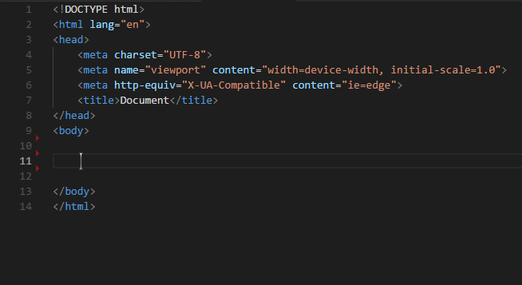
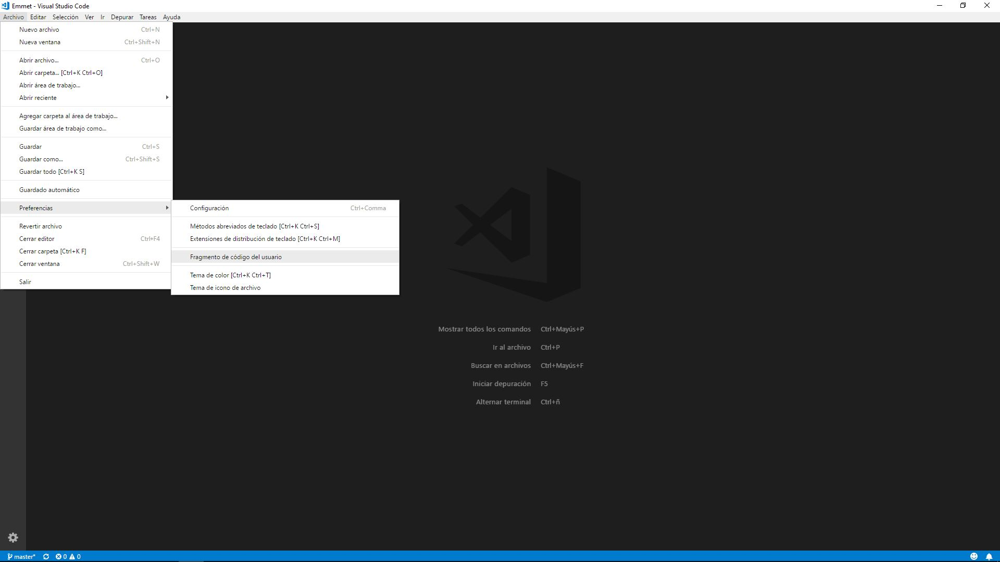
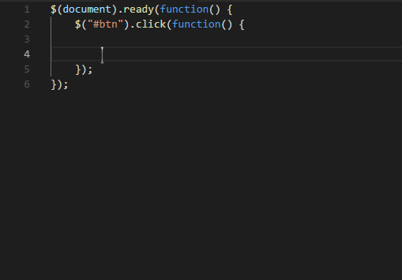

#  Emmet

[Emmet](https://emmet.io/ "Sitio oficial de Emmet") es un plugin disponible para una gran cantidad de editores de codigo que permite escribir de una forma mas sencilla y rapida. Su sintaxis sera adaptable a los lenguajes HTML y CSS.

## Tabla de contenidos

* [Instalacion](#instalacion)
* [Sintaxis](#sintaxis)<br>
&nbsp;&nbsp;&nbsp;[HTML](#html)<br/>
&nbsp;&nbsp;&nbsp;[CSS](#css)<br/>
* [Snippets](#snippets)<br>

## Instalacion

Dependiendo del editor en el cual se quiera instalar Emmet, habra que seguir unos pasos u otros. En el apartado de [descargas](https://emmet.io/download/) del sitio oficial de Emmet se proporciona una lista de los editores para los cuales esta disponible y los pasos que se deben seguir para su instalacion. En el caso del editor [Visual Studio Code](https://code.visualstudio.com/), ya tiene incorporado de por si la sintaxis de Emmet, por lo que no requiere una instalacion previa.

## Sintaxis

Emmet toma el concepto de ["snippet"](#snippets) y lo lleva mas alla generando una [sintaxis basada en CSS](). Como se ha dicho previamente, la sintaxis de Emmet es aplicable a los lenguajes HTML y CSS y sus abreviaciones seran detectadas en base a la extension del archivo.

### HTML

El ejemplo mas basico de los beneficios que puede brindar Emmet, es el ahorro de escribir las etiquetas. Simplemente escribiendo el nombre de una etiqueta y pulsando tabulacion o enter (dependiendo del editor), generara la etiqueta de apertura y cierre. Por ejemplo, si se escribe `div` y se pulsa enter, se generara automaticamente `<div></div>`.<br/> Si bien muchos editores ya tienen esta funcion integrada por defecto, forma parte de la sintaxis de Emmet.



Ademas, dependiendo la etiqueta que sea escrita, Emmet añadira atributos que son imprescindibles para el funcionamiento caracteristido de la etiqueta. Por ejemplo, si se escribe el nombre de la etiqueta `<a></a>`, Emmet producira:

```html
<a href=""></a>
```

Automaticamente le añadira el atributo "href".<br/>
El cursor automaticamente se posicionara entre las etiquetas de apertura y cierre. A esto se le denomina <b>"paradas"</b>. Para posicionar el cursor en la proxima parada, se puede presionar tabulacion.<br/>
A su vez, si el editor posee un IntelliSense instalado para Emmet, se podran ver las sugerencias asi como el resultado antes de pulsar enter o tabulacion en una ventana de dialogo proxima a la palabra escrita.<br/>
Un snippet muy beneficioso resulta ser "!" o "doc" que imprimira la estructura basica de una pagina HTML.<br/>
Emmet, al igual que muchas otras tecnologias, emplea [sintaxis CSS](https://github.com/1caruxx/Angular/tree/master/CSS#sintaxis) para hacer referencia a clases, id, atributos, etc de una etiqueta. Por ejemplo, para añadirle una clase a un etiqueta se usa el caracter punto "." como en CSS:

```
p.nombre-de-la-clase
```

Producira:

```html
<p class="nombre-de-la-clase"></p>
```

Para colocar dos o mas clases, se deberan escribir una detras de otra siempre con un punto por delante:

```
p.clase.otra-clase
```

Producira:

```html
<p class="clase otra-clase"></p>
```

Con el atributo id sucede algo muy similar:

```
p#id-de-la-etiqueta
```

Producira:

```html
<p id="id-de-la-etiqueta"><p>
```

Tambien es posible intercalarlos y el resultado sera el esperado:

```
p.clase#id-etiqueta.otra-clase
```

Producira:

```html
<p class="clase otra-clase" id="id-etiqueta"></p>
```

Para escribir cualquier otro atributo, se usaran los corchetes:

```
p[title="Esto es un parrafo" style="color: red;"]
```

Producira:

```html
<p title="Esto es un parrafo" style="color: red;"></p>
```

Para añadir contenido textual a una etiqueta, se debera usar apertura y cierre de llaves "{}":

```
div{Hola mundo!}
```

Produce:

```html
<div>Hola mundo!</div>
```

Otra regla de Emmet es que si se usa cualquiera de los anteriores signos y no se le asocia el nombre de una etiqueta, por defecto se creara un `<div>`. Por ejemplo:

```
.nombre-de-la-clase
```

Producira:

```html
<div class="nombre-de-la-clase"></div>
```

Otro caracter que proporciona Emmet es el doble punto ":" cuyo comportamiento es mas irregular y dependera de la etiqueta en el cual es implementado. No todas las etiquetas pueden usarlo. Un ejemplo podria ser la etiqueta `<input>` que con el caracter doble punto se puede determinar su tipo. Por ejemplo:

```
input:number
```

Producira:

```html
 <input type="number" name="" id="">
```

Otro ejemplo podria ser el tipo de relacion que se establecera en la etiqueta `<link>`:

```
link:css
link:favicon
```

Producira:

```html
<link rel="stylesheet" href="style.css">
<link rel="shortcut icon" href="favicon.ico" type="image/x-icon">
```

Con Emmet es posible generar etiquetas anidadas, hermanas, multiplicar etiquetas y usar contadores:

Para anidar etiquetas se puede usar el signo mayor que ">":

```
div>p
div>p>span
```

Producira:

```html
<div>
    <p></p>
</div>

<div>
    <p><span></span></p>
</div>
```

A su vez, para generar etiquetas hermanas o "sibling tags" se debe usar el signo de suma "+":

```
div+p
div>p+p+span
```

Producira:

```html
<div></div>
<p></p>

<div>
    <p></p>
    <p></p>
    <span></span>
</div>
```

Las etiquetas anidadas y hermanas son perfectamente combinables con clases, id y atributos. Por ejemplo:

```
.container#divCont>.content+.content+.content
```

```html
<div class="container" id="divCont">
    <div class="content"></div>
    <div class="content"></div>
    <div class="content"></div>
</div>
```

Para no tener que repetir una y otra vez las etiquetas que cumplan con las mismas caracteristicas, sepueden multiplicar usando el simbolo de multiplicacion "*":

```
.container#divContent>.content*5
```

Producira:

```html
<div class="container" id="divContent">
    <div class="content"></div>
    <div class="content"></div>
    <div class="content"></div>
    <div class="content"></div>
    <div class="content"></div>
</div>
```

Usando el caracter acento circunflejo "^" se puede subir entre los niveles de las etiquetas:

```
.container>.content*5^span{Hola mundo!}
```

Producira:

```html
<div class="container">
    <div class="content"></div>
    <div class="content"></div>
    <div class="content"></div>
    <div class="content"></div>
    <div class="content"></div>
</div>
<span>Hola mundo!</span> <!-- Al subirlo un nivel, estara al mismo nivel que el <div> contenedor y seran etiquetas hermanas, si se coloca ^, no se debe usar el simbolo de suma "+" -->
```

Se puede obtener el mismo comportamiento, encapsulando los grupos de etiquetas entre parentesis "()" y usando el operador "+":

```
(.container>.content*5)+span{Hola mundo!}
```

Produce:

```html
<div class="container">
    <div class="content"></div>
    <div class="content"></div>
    <div class="content"></div>
    <div class="content"></div>
    <div class="content"></div>
</div>
<span>Hola mundo!</span>
```

El signo pesos "$" servira como un contador que por cada iteracion o etiqueta que se cree, aumentara:

```
.container>.content*5{$}
```

Producira:

```html
<div class="container">
    <div class="content">1</div>
    <div class="content">2</div>
    <div class="content">3</div>
    <div class="content">4</div>
    <div class="content">5</div>
</div>
```

Esta herramienta que proporciona Emmet solo funcionara si la etiqueta se esta multiplicando. No solo se puede usar para contenido, sino tambien en los atributos. Ademas puede especificarse a partir de que numero (inclusive) se quiere que empiece a iterar este contador usando el caracter arroba "@":

```
.container>.content*5#item$@3{Hola mundo!}
```

Producira:

```html
<div class="container">
    <div class="content" id="item3">Hola mundo!</div>
    <div class="content" id="item4">Hola mundo!</div>
    <div class="content" id="item5">Hola mundo!</div>
    <div class="content" id="item6">Hola mundo!</div>
    <div class="content" id="item7">Hola mundo!</div>
</div>
```

A su vez se puede especificar que itere en el orden inverso usando el simbolo de resta "-":

```
.container>.content*5#item$@-{Hola mundo!}
```

Producira:

```html
<div class="container">
    <div class="content" id="item5">Hola mundo!</div>
    <div class="content" id="item4">Hola mundo!</div>
    <div class="content" id="item3">Hola mundo!</div>
    <div class="content" id="item2">Hola mundo!</div>
    <div class="content" id="item1">Hola mundo!</div>
</div>
```

Tambien se puede decir que empiece a iterar a partir de cierto indice y en el orden inverso combinando estos dos elementos:

```
.container>.content*5{$@-3}
```

Producira:

```html
<div class="container">
    <div class="content">7</div>
    <div class="content">6</div>
    <div class="content">5</div>
    <div class="content">4</div>
    <div class="content">3</div>
</div>
```

Si se escriben mas signos de pesos un detras de otro, los digitos sobrantes seran reemplazados por 0:

```
.container>.content*10{$$$}
```

Producira:

```html
<div class="container">
    <div class="content">001</div>
    <div class="content">002</div>
    <div class="content">003</div>
    <div class="content">004</div>
    <div class="content">005</div>
    <div class="content">006</div>
    <div class="content">007</div>
    <div class="content">008</div>
    <div class="content">009</div>
    <div class="content">010</div>
</div>
```

Emmet tambien permite generar texto aleatorio (en latin) para rellenar etiquetas y ver como se veria la pagina con contenido real. Esto es algo habitual durante la etapa de pruebas y generalmente se recurre a paginas externas como puede ser [Lipsum](https://es.lipsum.com/), sin embargo, escribien "lorem" y presionando enter o tabulacion, Emmet generara 30 palabras en latin. Tambien se puede determinar cuantas palabras se quieren generar añadiendo un numero entero, por ejemplo, escribir `lorem` producira:

```
Lorem ipsum dolor sit amet consectetur adipisicing elit.
Dignissimos aperiam, delectus, maiores placeat consequatur modi laborum debitis et corrupti ab
harum eos quae odio laboriosam obcaecati totam voluptatum nesciunt labore?
```

y `lorem10`:

```
Lorem ipsum dolor sit amet consectetur adipisicing elit. Officia, autem.
```

### CSS

El sistema de snippets que Emmet presenta para un codigo escrito en CSS varia del HTML. Ahora, se usan solo abreviaciones que formaran la propiedad completa, por ejemplo:

```
m ---> margin: ;
ml --> margin-left: ;
p ---> padding: ;
```

El sistema de abreviaciones que ofrece Emmet no es totalmente estricto e interpretara hasta cierto punto las abreviaciones escritas. Por ejemplo:

```
bgc --> background-color: ;
bgcr -> background-color: ;
bgco -> background-color: ;
```

Lo que quiere decir, que respetando cierta logica, una propiedad puede escribirse con multitud de abreviaciones. Tambien es posbile asignar una unidad de medida en la propia abreviacion:


```
m10 --> margin: 10px;
```

## Snippets

Un snippet es un trozo de codigo que se almacena que se almacena en un archivo de configuracion propio del editor en el que se este trabajando que posee una abreviacion o prefijo con el que puede ser invocado. Mismamente, el caracter "!" es un snippet proporcionado por Emmet que imprime en el archivo la estructura basica de un template HTML. El concepto de snippet no solo se limita a Emmet, sino que es posible crear snippets propios para cualquier lenguaje.<br/>
La creacion de un snippet varia entre editor y editor, pero se matienen ciertas reglas. Dependiendo del editor, los snippets sera almacenados en un solo archivo o varios. En el caso de VS code (el editor que estoy usando actualmente), se almacenan en varios archivos de formato JSON.<br/>
El primer paso, sera elegir el scope (entorno o lenguaje) en el que tendra validez el snippet. En el caso de que se este usando VS Code, se debera ir a Archivo > Preferencias > Fragmento de codigo del usuario y luego seleccionar un lenguaje.



Automaticamente se generara un archivo el la siguiente ruta: `C:\Users\%Usuario_actual%\AppData\Roaming\Code\User\snippets` con el nombre del lenguaje y extension `.json`.<br/>
Entre la apertura y cierre de llaves generadas por el archivo, se debera insertar un JSON con el siguiente formato:

```json
"identificador": {
    "prefix": "...",
    "body": "...",
    "description": "Estructura basica de una conexcion asincronica usando notacion jQuery."
}
```

El **identificador** sera el nombre del snippet, la clave que usa el editor para diferenciarlo del resto. No se debe repetir. La clave <b>"prefix"</b> o prefijo, hace referencia al nombre con el que se invocara al snippet estando en el archivo con la extension del lenguaje propio del snippet.<br/>
El <b>"body"</b> sera todo el codigo que se imprimira cuando el snippet sea invocado. Si el codigo estara comprendido en una sola linea, se puede encerrar entre comillas, pero si son mas lineas, se debera formar un array de strings en el que cada elemento resultar ser una linea de codigo. Si se quiere aplicar una identacion, se puede usar el caracter de escape <b>"\t"</b>.<br/>
Estas dos claves son obligatorias. <b>"description"</b> alude a una descripcion que aparecera en la ventana de dialogo del editor gracias a su IntelliSense. Esta clave es opcional.
El siguiente ejemplo demuestra como crear el snippet para una consulta asincronica escrita en jQuery:

```json
"ajax": {
    "prefix": "ajax",
    "body":[
        "$.ajax({",
            "\turl: \"$1\",",
            "\ttype: \"${2:POST}\",",
            "\tdata: \"$3\",",
            "\tdataType: \"${4:json}\",",
            "\tasync: ${5:true}",
        "})",
        ".done(function (response) {",
            "\t$6",
        "})",
        ".fail(function (response) {",
            "\t$7",
        "});$0"
    ],
    "description": "Estructura basica de una conexcion asincronica usando notacion jQuery."
}
```

Produce:



El simbolo de pesos "$" marcara una parada, es decir, la posicion donde el cursor permanecera. El numero que se le coloca al lado, indica el orden. Si se usa el numero 0, representa la ultima parada. Se puede navegar entre paradas pulsando tabulacion. Ademas, si el numero de la parada se asocia a una palabra de la siguiente manera `${n:palabra}`, se creara un "placeholder" y se seleccionara automaticamente cuando se posicione el cursor.<br/>
Para crear varios snippets, se deben separar por comas:

```json
"identificador": {
    "prefix": "",
    "body": "",
    "description": ""
},
"identificador": {
    "prefix": "",
    "body": "",
    "description": ""
}
```

Anotacion: En el caso de que escribiendo el prefijo, el snippet no entre en funcionamiento, reiniciar el editor pueder resolver el problema.