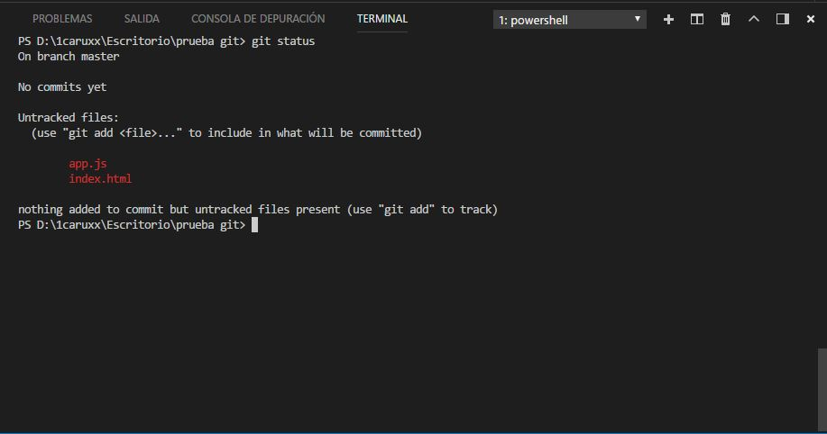
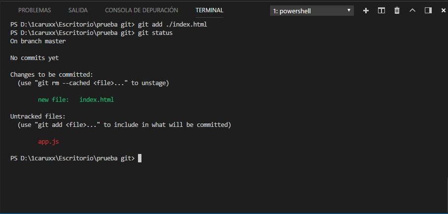
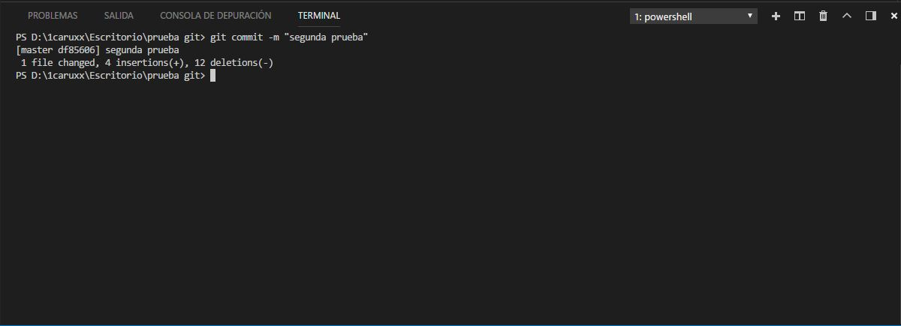
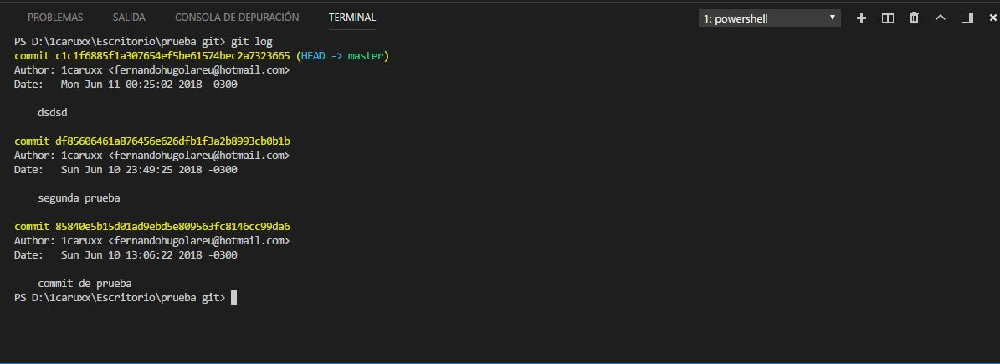
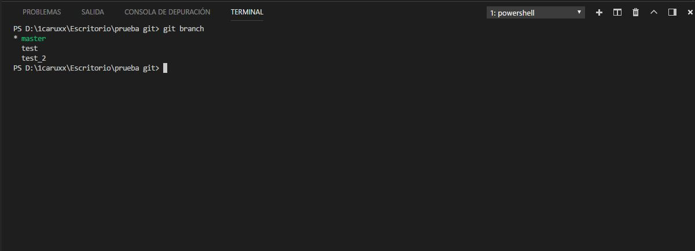

#  git

[git](https://git-scm.com/ "Pagina oficial de git") es el sistema de control de versiones mas popular. Con git, es posible crear snapshots (puntos de control a los que el proyecto se podra reestablecer) o distintas versiones del mismo proyecto. Tambien permite clonar repositiorios remotos o subir repositorios locales. Se puede descargar git en sus distintas versiones a traves del siguiente [enlace](https://git-scm.com/downloads "git downloads"). Esta herramienta proporciona una interfaz grafica de usuario (graphical user interface o "GUI") y ademas se integra al sistema operativo permitiendo aprovechar todas sus funcionalidades a traves de comandos.

## Tabla de contenidos

* [Estados de un proyecto](#estados-de-un-proyecto)
* [Primeros pasos](#Primeros-pasos)
* [Commits](#commits)<br/>
&nbsp;&nbsp;&nbsp;[Tags](#tags)
* [Branchs](#branchs)
* [Clonar y subir repositorios](#clonar-y-subir-repositorios)

## Estados de un proyecto

Los archivos de un proyecto, atravezaran por tres estados: "modified", "staged" y "committed". Los archivos que esten en el estado <b>"modified"</b> son aquellos que se encuentran actualmente en el <b>"working directory"</b> (el directorio de trabajo, aquel que contiene todos los archivos que se estan editando y que se pueden ver fisicamente), han sido modificados y que no han sido trasladados al <b>"staging area"</b>.<br/>
Los archivos que atraviezen por el estado <b>"staged"</b> son aquellos nuevos archivos o archivos modificados que han sido marcados para formar parte del proximo <b>"commit"</b>. Los archivos que atraviezen por el estado staged formaran parte del staging area. Un commit sera una snapshot (instantanea o punto de control) al cual se podran restaurar los archivos.<br/>
Finalmente se debera hacer un commit para que todos los archivos almacenados en el stagin area pasen a formar parte del <b>repositorio</b>. Un repositorio es un lugar donde es almacenada la historia de un proyecto. La historia de un proyecto consiste en el conjunto de commits asi como <b>"branchs"</b> (ramas o versiones del proyecto). Un repositorio puede ser local si se encuentra alojado en la maquina en la que se este trabajando, o remoto si se encuentra alojado en internet. Un ejemplo de un repositorio local, puede ser al directorio oculto `.git` que genera git en la raiz del proyecto y que necesita para trabajar. Un ejemplo de un repositorio remoto puede ser [github](https://github.com/).

## Primeros pasos

Lo primero que se debera hacer, es abrir una consola de comandos, sin importar cual ni el directorio en el que se este posicionado, y cofigurar git de forma global para añadir datos propios. Esto es necesario ya que varias personas pueden trabajar en un mismo proyecto y se debe dejar constancia de quien ha hecho determinado commit. Si no se realiza este paso, git no permitira hacer ningun commit. Para lograrlo, se deberan emplear dos comandos:

```
git config --global user.email "direccion de correo"
```

Este comando permitira asignar una direccion de correo.

```
git config --global user.name "nombre"
```

Y este para establecer un nombre. Ambos comandos pueden relanzarle las veces que uno desee para modificar el nombre o el correo, sin embargo, estos datos se incorporan de manera global a git, por lo que una vez seteados, no sera necesario relanzar los comandos, no importa cuantos proyectos se cree, a menos que se quieran modificar los datos.<br/>
Lo siguiente sera inicializar git en el directorio del proyecto, asi que sera necesario acceder a la raiz del proyecto a traves de la consola y ejecutar el siguiente comando:

```
git init
```

De esta forma, se creara el directorio oculto `.git` (el nombre de los directorios ocultos siempre son antecedidos por un punto) en donde se inicializara el repositorio del proyecto y sera alojado.<br/>
En el directorio del proyecto se añadiran archivos u otros directorios que conformaran la aplicacion. Estos archivos estaran en el working directory. Para comprobar el estado de los archivos, se puede lanzar el siguiente comando:

```
git status
```



Los nombres de los archivos modificados o que aun no hayan sido marcados y no formen parte del stagin area, se mostraran por consola con color rojo. Para cambiar un archivo al estado staged y que forme parte del proximo commit:

```
git add ./nombreDelArchivo.extension
```



Los nombres de los archivos cuyo estado sea staged se mostraran en verde. Si se quieren añadir varios archivos a la vez, simplemente se deben escribir sus nombres separados por espacios:

```
git add ./nombreDelArchivo.extension ./otroArchivo.extension
```
Y si se quieren añadir todos los archivos y directorios del proyecto, solo se debe escribir "." o "./" que hace referencia al directorio actual.
Por otro lado, si se quiere quitar un archivo del stagin area:

```
git rm --cached ./nombreDelArchivo.extension
```

Para remover varios archivos se debe usar la misma logica, pero si se quieren quitar todos los elementos del proyecto del stagin area, se debera añadir el parametro `-r`.<br/>
El ultimo paso sera commitear los archivos del stagin area, es decir, hacerles una snapshot para que se puedan recuperar cuando uno desee. Una vez hecho el commit, el estado actual de los archivos pasa a formar parte de la historia del proyecto y en su defecto, ese commit sera alojado en el repositorio del proyecto (directorio `.git`). El comando encargado de hacer esta tarea es:

```
git commit
```

Se abrira en la consola el editor de codigo que se haya seleccionado durante el proceso de instalacion de git. Aqui se debera introducir un comentario para que sea facil identificar el commit. Para insertar el comentario, se debera pulsar la tecla i. Una vez escrito el mensaje, se debe pulsar ESC y escribir `:wq` para salir del editor guardando los cambios. Por el contrario, si se quiere salir del editor sin guardar los cambios y no hacer el commit, se debe pulsar `Ctrl + C` y luego `:qa!` y pulsar enter.<br/>
Para evitar el proceso de entrar en el editor para crear comentario, se pede añadir el parametro `-m` seguido del mensaje escritor entre comillas:

```
git commit -m "Este es el comentario."
```

Acto seguido se mostrara por consola un resumen del commit, indicando la cantidad de archivos afectados, las inserciones, es decir, la suma de las lineas que se hayan agregado en los archivos y las eliminaciones, lineas de codigo que se hayan borrado.



## Commits

Para desplegar una lista de todos los commits almacenados en el repositorio del proyecto, se debe usar el siguiente comando:

```
git log
```



De esta forma se mostraran todos los commits asi como el autor de haya hecho el commit, la fecha exacta, el comentario para ayudar a identificarlo y el <b>"hash"</b> que sera un identificador unico para cada commit. `(HEAD -> master)` representa el commit en el cual se esta posicionado dentre del branch. Tambien se puede añadir el parametro `--oneline` para poder imprimir cada commit en una sola linea individual.<br/>
Para "volver en el tiempo" y desplazarse a un commit en especifico:

```
git checkout hash-del-commit
```

Este comando me posicionara con el commit fuera de la [branch](#branchs) en donde se podra trabajar con los archivos en el estado en que estaban cuando se hizo el commit, sin embargo, no se estara en ninguna branch en especifico, por lo que para guardar los cambios, se debera realizar el correspondiente commit y crear una nueva branch para que las modificaciones queden registradas en ella.

### Tags

## Branchs

Los branchs (ramas) son versiones paralelas del proyecto que englobaran un grupo de commits independientes. Por defecto, git crea una rama llamada <b>master</b> en donde realiza el registro de todos los commits que se vayan haciendo. Esta sera la rama principal del proyecto. Sin embargo, es posible crear nuevas ramas, listarlas, eliminarlas y fusionarlas. Para crear una nueva rama, se debera usar el siguiente comando:

```
git branch nombre_de_la_nueva_rama
```

Esta rama contendra todos los commits que posea la rama a partir de la cual se creo. Sin embargo, los commits que se hagan en esta nueva ya no formaran parte de la rama anterior.
A su vez, si se ejecuta este comando, pero no se especifica el nombre de una rama, se imprimira por consola un listado de todas las ramas del proyecto.



El asterisco indica la rama en la cual es esta posicionado. Al momento de crear una nueva rama, no se posiciona directamente sobre ella, por lo que para desplazarse entre ramas, se puede usar el comando:

```
git checkout nombre_de_la_rama
```

O si se desea, se puede crear y desplazar a la rama en una sola operacion, añadiendo el parametro `-b` al comando checkout:

```
git checkout -b nombre_de_la_nueva_rama
```
### gh-pages branch

## Clonar y subir repositorios

Clonar un repositorio significa descargar una copia de un repositorio remoto. Se debera usar el comando `clone` para hacer esta tarea:

```
git clone https://dominio/usuario/nombre-del-repositorio.git
```

Para subir modificaciones que se hagan en el repositorio local, primero sera necesario añadir el repositorio remoto al mismo. Esto se puede conseguir usando el comando `remote`:

```
git remote add alias https://dominio/usuario/nombre-del-repositorio.git
```

No solo se puede añadir un repositorio remoto, si no los que se desee. Por esta razon se le da un alias y es para identificarlo. Generalmente se asigna como alias `origin`, pero en el caso de añadir mas de un repositorio remoto, se tendran que ir creando alias diferentes. Para poder ver el listado de repositorios remotos a los cuales esta vinculado el proyecto:

```
git remote
```
Si el repositorio local, fue previamente clonado y no creado desde cero en la maquina local, no se debera añadir a la lista ya que este proceso se hace por defecto y el alias que se asigna sera `origin`.<br/>
Finalmente, para subir las modificaciones al repositorio remoto que se desee, se debera usar este comando:

```
git push alias branch
```

En donde el `alias` es el identificador del repositorio que se le asigno cuando se añadio a la lista y branch es la rama que se quiere subir.<br/>
Anotacion: En el caso de que se este realizando el push por primera vez, y el repositorio no haya sido clonado, el repositorio remoto debera estara completamente vacio ya que sino, git impedira hacer el push para no pisar los archivos alojados en el repositorio remoto.

## Ignorar archivos