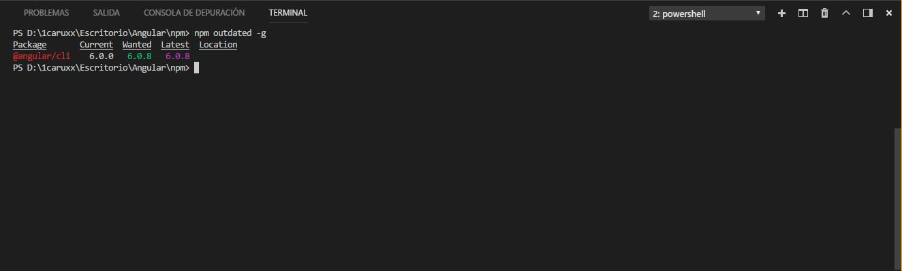

#  npm

[npm](https://www.npmjs.com/ "Pagina oficial de npm") que por sus siglas significa, Node Package Manager o gestor de paquetes de node. Este es un software que permite descargar, actualizar, eliminar y administrar de forma general paquetes. Un paquete es un archivo o conjunto de los mismos que almacena codigo en su interior y proporcionan diversas funcionalidades. Por ejemplo, una libreria, api o framework descargado mediante npm, son considerados a su vez paquetes, porque ademas de descargar los mismos, se añadiran sus dependencias y archivos complementarios que pueden ser usados o no y se registrara en un archivo especial llamado `package.json`.

## Tabla de contenidos

* [Instalacion y uso](#instalacion-y-uso)
* [Instalacion de paquetes](#instalacion-de-paquetes)
    * [Archivo package.json](#archivo-package.json)
    * [Dependencias](#dependencias)
* [Actualizacion y desinstalacion de paquetes](#actualizacion-y-desinstalacion-de-paquetes)
* [Scripts y Concurrently](#scripts-y-concurrently)

## Instalacion y uso

npm es el gestor de paquetes de [node.js](https://nodejs.org/es/ "Pagina oficial de node.js"), lo que quiere decir que se instalara por defecto al instalar node.js. Una vez instalado node.js, se tendra acceso al CLI (command line interface o intefaz de lineas de comandos) de npm. Para verificar su correcta instalacion, se puede lanzar el siguiente comando en cualquier consola, sin importar donde se este posicionado:

```
npm -v
npm --version
```

Para actualizar la version de npm:

```
npm install -g npm@latest
```

Y para conprobar una lista de los comandos disponibles:

```
npm -h
npm --help
```

## Instalacion de paquetes

Existen dos formas de instalar paquetes con npm:
* **Localmente:** El paquete sera instalado dentro del directorio del proyecto, en una carpeta llamada `node_modules` (se crea por defecto en el caso de que no exista). Este es el tipo por defecto de instalacion del comando `install` o `i`, el cual se usa para instalar paquetes:

```
npm install <paquete>
npm i <paquete>
```

A su vez, se creara el archivo `package-lock.json`. Este archivo se generara de forma automatica por cada cambio que se haga al directorio `node_modules` o el archivo `package.json` (a traves de los comandos de npm) y contendra la informacion de todo el arbol de dependencias que requiera el proyecto asi como la version de cada una. Una dependencia es un paquete del cual depende el proyecto u otro paquete.

* **Globalmente:** El paquete se incorporara al sistema operativo y en el caso de que disponga de una interfaz de linea de comandos, podra ser accedida desde cualquier directorio y usada para cualquier proyecto. Para instalar de esta forma, se debe añadir el parametro `--global` o `-g`:

```
npm i --global <paquete>
npm i -g <paquete>
```

A su vez, es posible especificar la version del paquete que se quiere instalar, añadiendo una aroba "@" y el numero de la version despues del paquete:

```
npm i <paquete>@version
npm i -g <paquete>@version
```

Para comprobar la lista de paquetes instalados local y globalmente a si como sus respectivas versiones, se puede lanzar el comando `list`:

```
npm list
npm list -g
```

### Archivo package.json

A su vez, si no se le espcifica el paquete a instalar al comando `install`, instalara todas las dependencias que aparezcan en el archivo `package.json`. Este archivo contendra cierta informacion del proyecto asi como las dependencias que usa. Para crear este archivo, npm brinda un asistente a traves de este comando:

```
npm init
```

En este asistente se hacen unas preguntas en la que se deberan introducir datos que apareceran en el archivo final. Si se añade el parametro `--yes` o `-y`, se creara un archivo `package.json` por defecto (como si se hubiese presionado enter a todas las preguntas del asistente).<br/>
Un archivo `package.json` tendra la siguiente estructura:

```javascript
{
  "name": "npm", // El nombre del proyecto, por defecto se le asigna el nombre del directorio en el cual se esta posicionado
  "version": "1.0.0", // La version actual del proyecto, por defecto se le asigna 1.0.0
  "description": "", // La descripcion del proyecto, por defecto no se le asigna nada, pero si existe un archivo README.md o README, se le asignara la primer linea de este archivo
  "main": "index.js", // El archivo principal del proyecto, por defecto se le asigna "index.js" o el primer archivo con extension .js que encuentre en el directorio
  "dependencies": {}, // Un objeto de tipo JSON en el que se especifican las dependencias de produccion asi como la version
  "devDependencies": {}, // Un objeto de tipo JSON en el que se especifican las dependencias de desarollo asi como la version
  "scripts": { // Scripts de npm
    "test": "echo \"Error: no test specified\" && exit 1"
  },
  "keywords": [],
  "author": "", // El o los autores del proyecto
  "license": "ISC" // La licensia del proyecto
}
```

### Dependencias

Existen dos tipos de dependencias:

* **Dependencias de produccion:** Estas dependencias son aquellas que necesita el proyecto para funcionar. Seran listadas en la clave "dependencies" en el JSON del archivo `package.json`. Por defecto, las dependencias previamente instaladas a la creacion del `package.json` se listaran en esta clave y tambien aquellas que se instalen despues ya que por defecto, el comando `install` tiene como parametro `--save-prod`. Este parametro añade la dependencia instalada a la clave "dependencies".<br/>
Si se quiere instalar solamente las dependencias de produccion listadas en el archivo `package.json`:

```
npm i --only=prod
```

* **Dependencias de desarollo:** Estas dependencias son aquellas que se necesitaran solo durante la fase de desarollo. Seran listadas en la clave "devDependencies" en el JSON del archivo `package.json`. Al momento de instalar un paquete, se puede usar el parametro `--save-dev` o `-D` para que este sea añadido a la lista de dependencias de desarollo en lugar de las de produccion:

```
npm i --save-dev <paquete>
npm i -D <paquete>
```

Si se quiere instalar solamente las dependencias de desarollo listadas en el archivo `package.json`:

```
npm i --only=dev
```

La instalacion, actualizacion y desinstalacion de dependencias se vera reflejada automaticamente en el archivo `package.json`.

## Actualizacion y desinstalacion de paquetes

El comando `outdated` permite comprobar que paquetes instalados estan actualmente desactualizados. Tambien especifica que version requiere el proyecto y cual es la ultima version disponible.

```
npm outdated
npm outdated -g
```



El comando `update` permite actualizarlos:

```
npm update
npm update -g
```

Finalmente, el comando `uninstall` permite desinstalar paquetes. En el caso de que sean locales, automaticamente seran borrados de la lista de dependencias en `package.json`.

```
npm uninstall <paquete>
npm uninstall -g <paquete>
```

## Scripts y Concurrently

Los scripts de npm son una serie de comandos que pueden ser configurables desde el archivo `package.json` para ejecutar cualquier otro comando. Estos [scripts](https://docs.npmjs.com/misc/scripts) son los que se podran colocar en `package.json`:<br/>

Archivo package.json:

```json
"scripts": {
    "start": "echo Hola mundo!"
}
```

Consola:

```
npm start

Salida:

Hola mundo!
```

A su vez, es posible crear scripts propios a lo que se le conoce como "comandos arbitrarios". Para ejecutar un comando arbitrario, se debera usar el comando `run`:

Archivo package.json:

```json
"scripts": {
    "saludar": "echo Hola mundo!"
}
```

Consola:

```
npm run saludar

Salida:

Hola mundo!
```

Un problema con los scripts de npm es que es posible ejecutar varios comandos a la vez, pero no mantener varios procesos activos en una misma consola:

```json
"scripts": {
    "watch-sass": "...",
    "watch-pug": "...",
    "watchdogs": "npm run watch-sass && npm run watch-pug"
}
```

Si se lanza el comando `npm run watchdogs`, solo el primer proceso asignado sera el que se mantendra en ejecucion

[Concurrently](https://www.npmjs.com/package/concurrently) es un paquete que permite ejecutar varios procesos a la vez en una misma consola. Es una herramienta muy util que forma una gran sinergia con los scripts de npm para automatizar tareas. Simplemente se debera descargar el paquete de forma local y crear un script que dispare el comando `concurrently` y a este a su vez, pasarle todos los procesos que se quieren ejecutar de forma simultanea:

```json
"scripts": {
    "watch-typescript": "...",
    "watch-sass": "...",
    "watch-pug": "...",
    "watchdogs": "concurrently \"npm run watch-typescript\" \"npm run watch-sass\" \"npm run watch-pug\""
}
```

Los comandos deberan estar encerrados entre comillas ya que de otro modo, cada palabra sera interpretada como un comando individual. A su vez, tambien es posible ejecutar todos los comandos que empiezen con una palabra en concreto:

```json
"scripts": {
    "watch-typescript": "...",
    "watch-sass": "...",
    "watch-pug": "...",
    "watchdogs": "concurrently npm:watch-*"
}
```